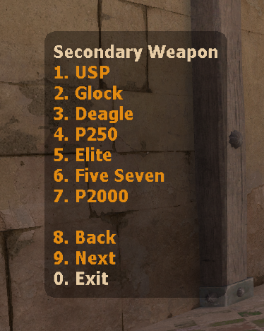

# SharpModMenu

A native CSSUniversalMenuAPI implementation, mirroring the behavior of SourceMod radio menus for CounterStrikeSharp.

https://www.youtube.com/watch?v=Be7qop6pVpI

Many thanks to [@T3Marius's CS2ScreenMenuAPI](https://github.com/T3Marius/CS2ScreenMenuAPI) for acting as reference when it comes to using the point_worldtext entity.

<!--

TODO:
- Sounds
- Disable weapon switching
- WASD
 - Hook CreateMove or similar to stop the player
- Automatically detect when to enable WASD features

-->
