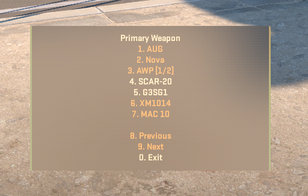

# SharpModMenu

A native CSSUniversalMenuAPI implementation, mirroring the behavior of SourceMod radio menus for CounterStrikeSharp.

https://www.youtube.com/watch?v=Be7qop6pVpI

When number keys are bound with the following snippet, automatically detected and the menu will look like it used to in CSS and CS:GO:

```
bind 1 "slot1;css_1"
bind 2 "slot2;css_2"
...
bind 9 "slot9;css_9"
bind 0 "slot0;css_0"
```


When these binds are not present, the player is prevented from moving, and the following keys are used to control the menu:

| Key         | Action              |
|-------------|---------------------|
| Forward (W) | Move selection up   |
| Back (S)    | Move selection down |
| Left (A)    | Previous/back       |
| Right (D)   | Next                |
| Use (E)     | Select item         |
| Reload (R)  | Exit                |


In the event that there is no spectator on which to create the predicted view model, the system will further fall back to
a CenterHtmlMenu for that free roaming player.



Many thanks to [@T3Marius's CS2ScreenMenuAPI](https://github.com/T3Marius/CS2ScreenMenuAPI) for acting as reference when it comes to using the point_worldtext entity.

<!--

TODO:
- Sounds

-->
